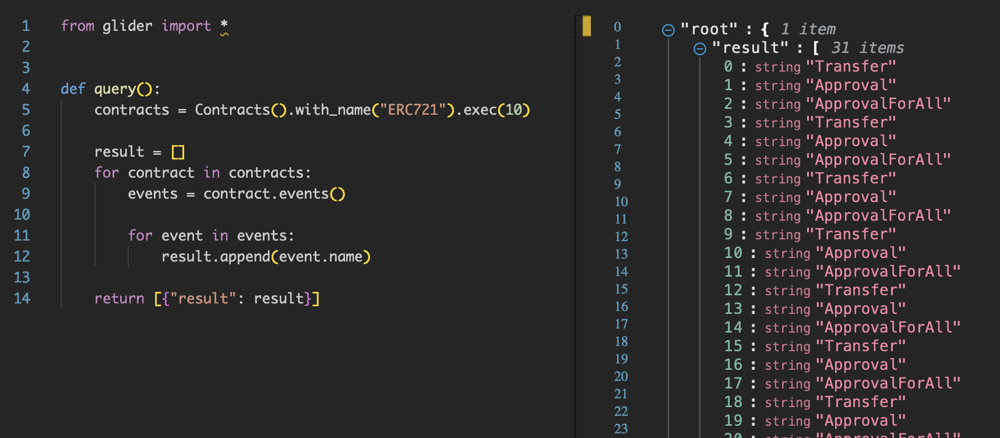

# Arbitrary Logic

We're continuing to modify the glide:

```python
from glider import *


def query():
    contracts = Contracts().with_name("ERC721").exec(10)
    return contracts
```

This time, we're going to add more logic to it besides the initial request to the DB.

`contracts` variable contains `List[Contract]`, remember? What we can do is loop through the contracts, as was mentioned in [Get Started](../get-started/README.md), getting some properties.

## Modifications

To begin with, let's add a for loop and change the return statement using the trick from [Get Started](../get-started/README.md) to return an empty array:

```python
from glider import *


def query():
    contracts = Contracts().with_name("ERC721").exec(10)

    for contract in contracts:
        contract

    return []
```

Doesn't make much sense at the moment because it just returns nothing :D

Anyway, the important difference is that now we have individual access to every `Contract` instance from our DB request. What can we do with it? Let's check the [Contract API documentation](https://glide.gitbook.io/main/api/contract)... `Contract.events()` looks promising if we want to get all the events of the contracts.

Add the method call and wrap it in `print()`:

```python
from glider import *


def query():
    contracts = Contracts().with_name("ERC721").exec(10)

    for contract in contracts:
        print(contract.events())

    return []
```

And hit the run button!

Oops, we got something strange in the output :)

The new `PRINT` window that you see contains technical data about the objects from the DB, but we want readable event names. I'll spare your time and tell that if we try to output one `Event` it'll lead to almost the same result again. And this means we need to:

1. Save the events to a new variable.
2. Loop through again.
3. Call one of the `Event` properties or methods ([docs](https://glide.gitbook.io/main/api/event)) to get any serializable value, like `.name`.
4. Print it instead.

```python
from glider import *


def query():
    contracts = Contracts().with_name("ERC721").exec(10)

    for contract in contracts:
        events = contract.events()

        for event in events:
            print(event.name)

    return []
```

And our beautiful glide is done! It'll output all the event names from the first ten contracts in the DB with the "ERC721" name:



## Read next: [Boosting the declarative part](../boosting-declarative-part/README.md)
