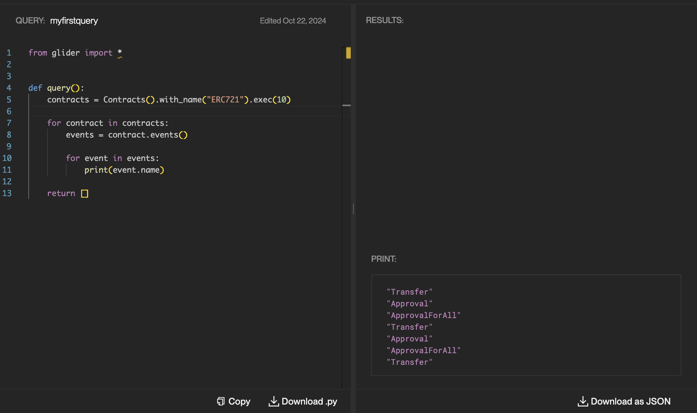

# Arbitrary Logic

We're continuing to modify the glide:

```python
from glider import *


def query():
    contracts = Contracts().with_name("ERC721").exec(10)
    return contracts
```

This time, we're going to add more logic to it besides the initial request to the DB.

`contracts` variable contains `List[Contract]`, remember? What we can do is loop through the contracts, as was mentioned in [Get Started](../get-started/README.md), getting some properties.

## Modifications

To begin with, let's add an additional variable between the two other instructions and change the return statement to this variable:

```python
from glider import *


def query():
    contracts = Contracts().with_name("ERC721").exec(10)

    result = []

    return result
```

We will save the properties there.

Next, we'll add a for loop, which will append contracts to the `result` variable:

```python
from glider import *


def query():
    contracts = Contracts().with_name("ERC721").exec(10)

    result = []
    for contract in contracts:
        result.append(contract)

    return result
```

This doesn't make much sense at the moment because the result of this glide is identical to the one without these modifications :D

Anyway, now we have individual access to every `Contract` instance from our DB request. What can we do with it? Let's check the [Contract API documentation](https://glide.gitbook.io/main/api/contract)... `Contract.events()` looks promising.

Add the method call:

```python
from glider import *


def query():
    contracts = Contracts().with_name("ERC721").exec(10)

    result = []
    for contract in contracts:
        result.append(contract.events())

    return result
```

And hit the run button!

Oops, an error :) `TypeError: Object of type Event is not JSON serializable` means we're trying to put something wrong to the output.

As you can see in the documentation, the method returns `List[Event]` type. I'll spare your time and tell that if we try to output one `Event` it'll lead to an error again. And this means we must:

1. Save the events to a new variable.
2. Loop through again.
3. Call one of the `Event` properties or methods ([docs](https://glide.gitbook.io/main/api/event)) to get any serializable value, like `.name`.
4. Change the return statement using the trick from [Get Started](../get-started/README.md)

```python
from glider import *


def query():
    contracts = Contracts().with_name("ERC721").exec(10)

    result = []
    for contract in contracts:
        events = contract.events()

        for event in events:
            result.append(event.name)

    return [{"result": result}]
```

And our beautiful glide is done! It'll output all the event names from the first ten contracts in the DB with the "ERC721" name:



## Read next: [Boosting the declarative part](../boosting-declarative-part/README.md)
