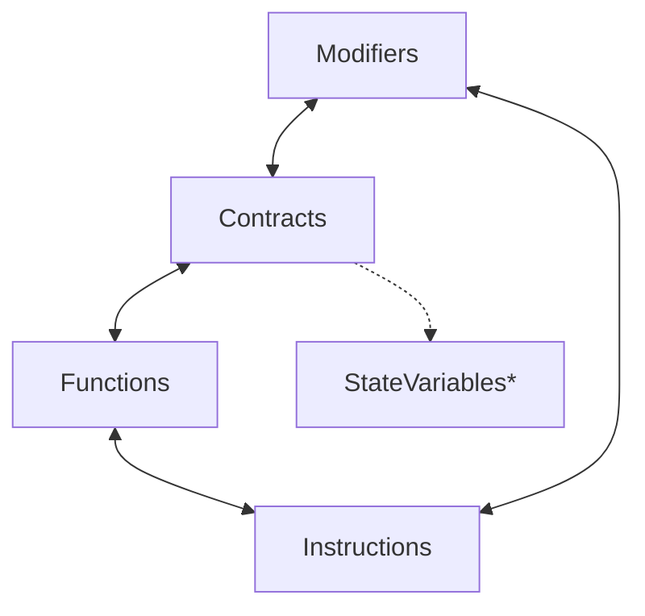

# Boosting the declarative part

The declarative DB query is so much more than just the `Contracts` object!

To be precise, it is:

1. Contracts
2. Functions
3. Modifiers
4. Instructions
5. StateVariables

Each has many methods, and more importantly, you can combine them in the same query, filtering out unnecessary entities and improving the subsequent arbitrary logic part.

## Example

Take a look at this glide from the examples on the website:

```python
from glider import *


def query():

    instructions = (
        Functions()
        .without_properties([MethodProp.HAS_MODIFIERS])
        .instructions()
        .with_callee_function_name("selfdestruct")
        .exec(100)
    )

    return instructions

```

It steps down from `Functions` to `Instructions` and uses both. In the first step, it gets rid of the functions with any modifiers, and in the second step, it queries all the instructions containing `selfdestruct` call from the remaining functions.

## Up-n-Down

Think of the combinations as layers where the contracts are the highest level and instructions are the lowest. You can jump between these layers however you like, one at a time. The final jump will determine what you'll get as a result.

All the possible transitions (pay attention to the directions):



_\*You can get `StateVariables` from a `Contract` instance or use as the first entry_

E.g., if you add `.functions()` to the glide above, you'll get `List[Function]`, where each is without modifiers and contains `selfdestruct` as one of their instructions.

```python
from glider import *


def query():

    functions = (
        Functions()
        .without_properties([MethodProp.HAS_MODIFIERS])
        .instructions()
        .with_callee_function_name("selfdestruct")
        .functions()
        .exec(100)
    )

    return functions

```

## Optimization notes

I have a few tips for you when it comes to the performance during combinations:

1. Try to avoid stepping up because it requires much more time (e.g., `Functions` -> `Contracts`).
2. If you need to step up, try to wrap your query like a sandwich, even if you don't need to use any methods from an upper layer. For example, if you need to do some logic with `Instructions` but want to get functions as a result, then:

   1. Initiate the query with `Functions`
   2. Step down to `Instructions`
   3. Perform your operations
   4. Get back to `Functions` (like in the glide above)

   This trick will cut out all instructions not in functions beforehand (like instructions from modifiers); thus, your operations will be performed on fewer instances.

3. It's also useful to think about the size of the data you operate with and the complexity of operations. It's better to filter out as much as you can with simple operations before getting to complex ones like filtration by function signature.

Mix and experiment!

## Read next: [Debug Technique](../debug-technique/README.md)
