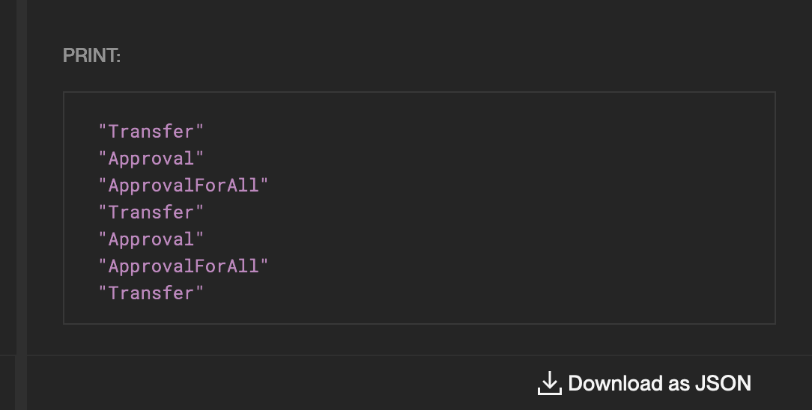
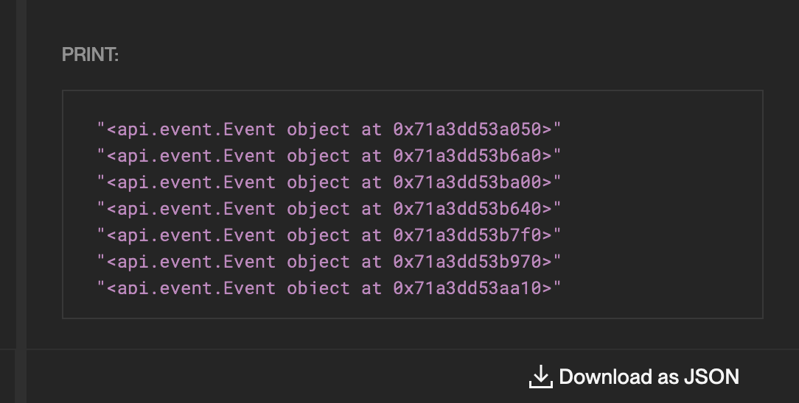

# Debug Technique

Errors are frustrating and can cause aggression and violence towards your computer. Today, we'll talk about a few methods of their location and correction.

The usual workflow for writing a new glide is as follows:

1. You start with the declarative query part and a small subset of instances (e.g., the limit is 10).
2. Continue with the arbitrary logic part, gradually improving it and covering the subset.
3. When you think the glide is ready, you run it on a larger subset (e.g., 1000) to see how long it takes to execute.
4. Then, you optimize, if necessary, and start over again.

## Limit and offset casino

Often, on the 3rd step, you'll encounter random errors, which means you forgot about some possibility. The best way to find the reason is to find the instance where the error happens.

To do this, you need to narrow the limit and offset in the declarative part so there is just one instance left, and the error still happens.

It'll usually look like this:

| **Step** | **Limit** | **Offset** | **Error** |
| -------- | --------- | ---------- | --------- |
| 1        | 100       | 0          | true      |
| 2        | 50        | 0          | false     |
| 3        | 25        | 50         | false     |
| 4        | 12        | 75         | true      |
| 5        | 6         | 75         | false     |
| 6        | 3         | 81         | true      |
| **7**    | **1**     | **81**     | **true**  |

Step by step:

1. The initial error occurrence.
2. We checked the lower half, and there's no error, which means it is somewhere > 50.
3. Again, we checked the lower half; there's also no error, > 75.
4. The error occurred this time, meaning it is > 75 and < 87.
5. Another miss, > 81 and < 87.
6. A hit, we're near.
7. Alright, this is the instance.

## Print

One of the most useful functions is `print()`, which obviously prints objects using the default output. It allows you to quickly look up what type of object you are trying to deal with or return things immediately without temporary variables.

For example, look at one of the previous glides from [Arbitrary Logic](../arbitrary-logic/README.md):

```python
from glider import *


def query():
    contracts = Contracts().with_name("ERC721").exec(10)

    for contract in contracts:
        events = contract.events()

        for event in events:
            print(event.name)

    return []
```

The new window that you see under the results is where all the print output will appear:



`print()` is very vercatile, you can print this as well:

```python
from glider import *


def query():
    contracts = Contracts().with_name("ERC721").exec(10)

    for contract in contracts:
        events = contract.events()

        for event in events:
            # print(event.name)
            print(event)

    return []
```



And even this:

```python
from glider import *


def query():
    contracts = Contracts().with_name("ERC721").exec(10)
    print("Contracts:")
    print(contracts)

    print("Events:")
    for contract in contracts:
        events = contract.events()
        print(events)

    return []
```


As you can see, it's not trying to serialize objects but returns their classes, such as `api.event.Event`, avoiding errors when serialization is not possible. This helps a lot as you can now see what you're dealing with and find all the necessary references in the documentation.

## Try/except

You can also utilize Python's try/except pattern instead of the limit changes, but it requires code tweaks, which can be inconvenient sometimes:

```python
    try:
        print(1)
        # ...

    except Exception as err:
        print(err)
        print(your_instance.source_code())
        return True
```

## Read next: [Functions](../functions/README.md)
