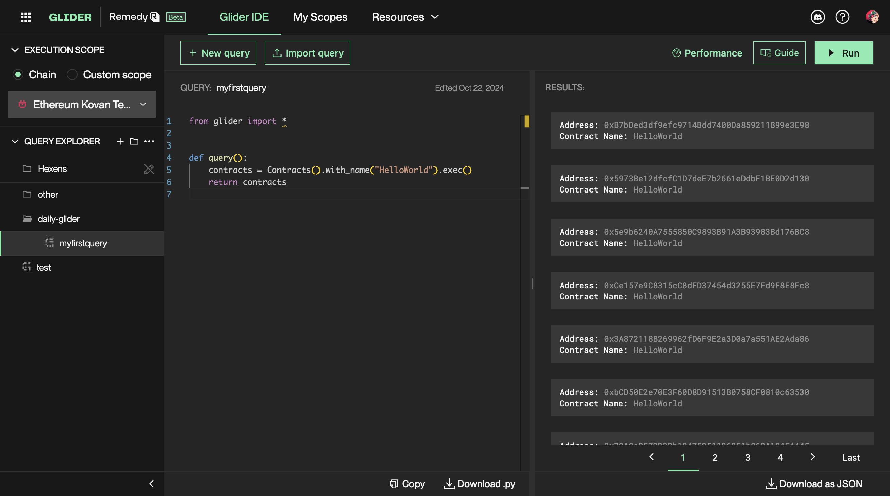

# Get Started

Alright, straight to business?

First things first, get familiar with these links; you'll need to use them quite often:

- [Official guidelines](https://glide.gitbook.io/main)
- [API documentation](https://glide.gitbook.io/main/api)
- [Glider itself](https://glide.r.xyz/)
- [#glider channel in Discord](https://discord.gg/remedy)
- [Security wiki](https://wiki.r.security/wiki/Main_Page) by Remedy to find interesting attack vectors (or [contribute](https://wiki.r.security/w/index.php?title=Special:CreateAccount) yours!)

## Hello, world!

After registering on the website, you'll see `MY QUERIES` on the left. Click `New Query` and give it some name, then copy and insert this:

```python
from glider import *


def query():
    contracts = Contracts().with_name("HelloWorld").exec()
    return contracts

```

> Throughout this course you'll see mentions of both queries and glides. These are the same things used interchangeably.

Click `Run`:



The result of the glide will appear on the right side. It returned all the contracts with `HelloWorld` name on Kovan. E.g.:

```solidity
contract HelloWorld {
    ...
}
```

Below, under the `Results` tab, you will find the total number of such contracts, the total memory usage, and the execution time. The memory and execution times are currently [limited](https://glide.gitbook.io/main/limitations).

Read more about the web interface in the guidelines: [Usage](https://glide.gitbook.io/main/usage).

## Line by line

As you might have guessed, the code is a restricted Python. It helps if you are familiar with the syntax, but it's not complicated anyway.

The glide starts with an import:

```python
from glider import *
```

It is only required to enable Intellisense autocomplete. You can drop it if you want; it's optional.

Next comes the main function of any glide:

```python
def query():
```

You **must** write it in every glide because it acts as an entry point. Otherwise, you'll get `KeyError: 'query'`.

Inside this function, you can see the glide's declarative part:

```python
    contracts = Contracts().with_name("HelloWorld").exec()
```

From the [guidelines](https://glide.gitbook.io/main/writing-gliders):

> A glider code can be separated into two parts: declarative queries (also called online part) and imperative arbitrary logic part (offline part)

I'll explain this distinction in more detail in the following articles.

For now, you just need to understand what it does, which is very obvious:

1. `Contracts()` is used to get access to all the contracts on a blockchain ([docs](https://glide.gitbook.io/main/api/contracts))
2. `.with_name("HelloWorld")` filters out only those with the specified name ([docs](https://glide.gitbook.io/main/api/contracts/contracts.with_name))
3. `.exec()` indicates the end of this request ([docs](https://glide.gitbook.io/main/api/contracts/contracts.exec))

The `contracts` variable will contain `List[Contract]`, which you can loop through or just return as was done in the glide:

```python
return contracts
```

The `query()` return statement will output the object to the standard output on the right. The object should be of a `List[Dict]` type. An array of JSONs, in other words. If you don't want to output anything, you can return an empty array:

```python
return []
```

Sometimes, you need to return a string or a number. In this case, you do it like this:

```python
return [{"test_string": "abc", "test_number": 1}]
```


You'll see some examples later on.

## Read next: [Limit and Offset](../limit-and-offset/README.md)
