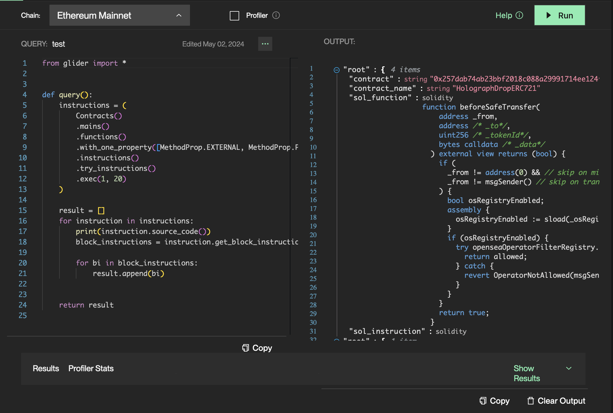
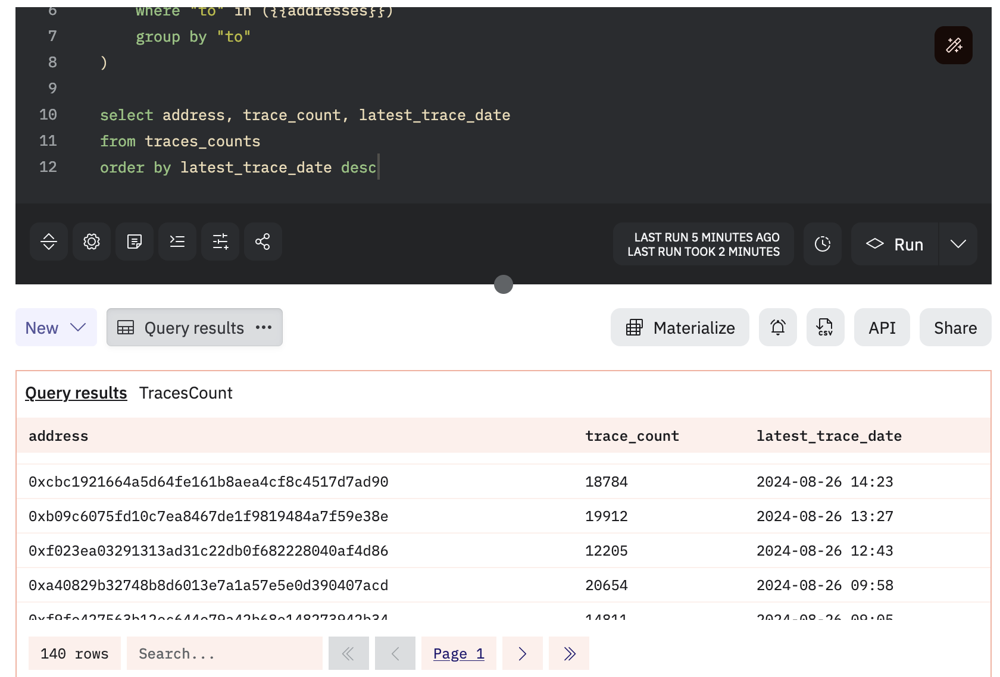

# Handy Scripts and SQL Queries

I've made a couple of queries to help you find valuable contracts in the Glider output because it can be lengthy.

## Extract contract addresses and deduplicate

The first step is to make a nice list of addresses out of the Glider's standard output of contracts, instructions, or functions.

This little NodeJS script below helps with it:

```js
const { readFileSync, writeFileSync } = require("fs");

async function main() {
  const rawAddresses = readFileSync("./rawAddresses.txt");

  let addresses = rawAddresses
    .toString()
    .match(/contract\\": \\"0x[0-9a-fA-F]{40}/g)
    .join(",")
    .match(/0x[0-9a-fA-F]{40}/g);

  addresses.sort();
  addresses = [...new Set(addresses)];

  console.log(addresses);
  writeFileSync("./filteredAddresses.txt", addresses.join(",\n"));
}

main();
```

It doesn't require anything other than a vanilla NodeJS (I use v20).

Just hit the "Copy" button in the bottom right corner and paste it into `./rawAddresses.txt` (create the folders).



Run the script with `node ./extractAddresses.js` and check the result in `./filteredAddresses.txt`.

## Order contracts by the number of traces

The next step is to get the most popular and the most recently used contracts from the list.

One of the ways to do it quickly is to use Dune, another big data query engine that works with the blockchain state.

You can copy paste the query below and run it on the free tier:

```sql
with

traces_counts as (
    select "to" as address, count(*) as trace_count, max(block_time) as latest_trace_date
    from ethereum.traces
    where "to" in ({{addresses}})
    group by "to"
)

select address, trace_count, latest_trace_date
from traces_counts
order by latest_trace_date desc
```

Put the addresses from the previous script as input, and you'll get something like:



Now, you can more easily sort by the number of traces or by the freshest trace. This will help you save your time checking old or unused contracts.

I use traces instead of transactions because when you query with Glider, most of the time, you get implementation contracts, and they don't actually get any incoming or outgoing transactions. Proxies call them with delegate calls, so if you look up such an address on Etherscan, it'll be empty, though the proxies pointing to it may be full of vulnerable assets.

There's another modification of the query, which will also output contracts with traces, but this time it'll also check if there are any assets on the contracts:

```sql
with

addresses_with_balances as (
    select address, token_address, balance_raw
    from (
        select *, row_number() over (partition by token_address order by block_number desc) as _rn
        from tokens_ethereum.balances
        where (
            balance > 0
            and blockchain = 'ethereum'
            and address in ({{addresses}})
        )
    )
    where _rn = 1
),

traces_counts as (
    select "to" as address, count(*) as trace_count, max(block_time) as latest_trace_date
    from ethereum.traces
    where "to" in (select address from addresses_with_balances group by address)
    group by "to"
)

select address, trace_count, latest_trace_date
from traces_counts
order by latest_trace_date desc
```

But use it carefully because it's not as universal as the previous one, and you may lose some valid entries.
