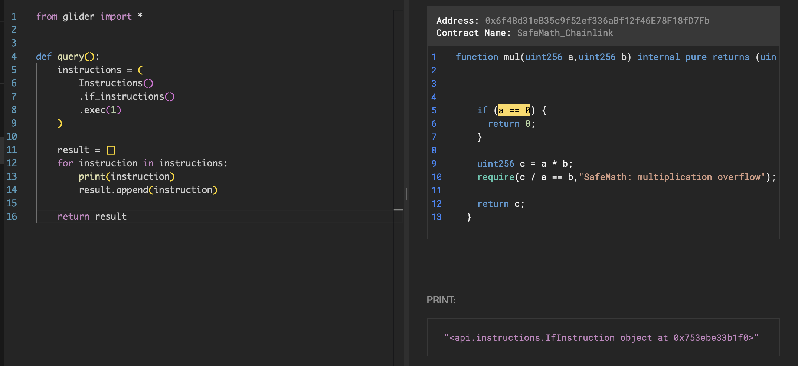
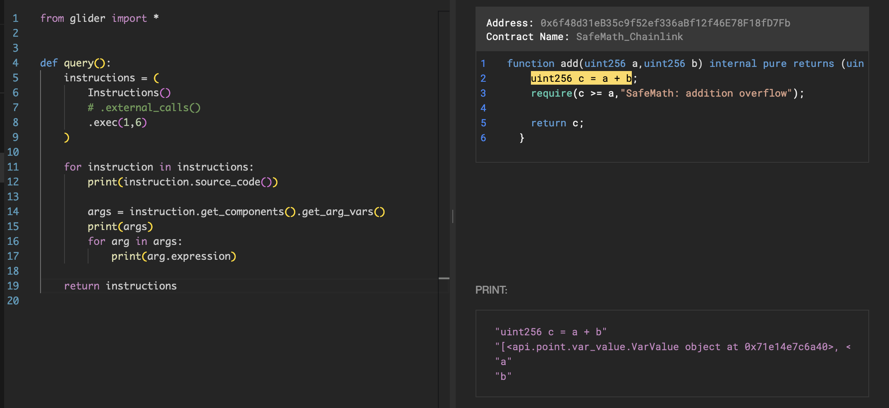

# Instruction

The last of the trio, `Instruction`, is another huge class with 50 methods in total + 6 from its child classes (there will be more!). This here is where you'll spend most of your time when you write complex glides, trying to generalize the way your code processes different combinations of Solidity instructions expressed through the Glider's objects.

## Children

`Instruction` comes in many forms, like:

- `AssemblyInstruction`
- `IfInstruction`
- `NewVariableInstruction`
- `ReturnInstruction`
- `ThrowInstruction`
- ...

Each child class represents a type of Solidity instruction. For example, if you filter `if` condition statements in the declarative query, the resulting instructions will all be of the `IfInstruction` class:

```python
from glider import *


def query():
    instructions = (
        Instructions()
        .if_instructions()
        .exec(1)
    )

    result = []
    for instruction in instructions:
        print(instruction)
        result.append(instruction)

    return result
```



## Methods

Each child will gradually have more individual methods, but they all inherit from the general `Instruction`.

The most useful methods are:

- `.get_components()` is a newly added method that returns a list of all components of an instruction. You can use other methods right after it:
  - `.get_callee_values()` to get all calls that an instruction contains (including internal)
  - `.get_*_vars()`, a set of methods that return different variables used in an instruction, like function arguments, state variables, etc.
- `.get_parent()` to step up to the parent function or modifier
- `.is_storage_read()` and `.is_storage_write()` to check whether an instruction contains a storage read or write
- `.next_instruction()`, `.previous_instruction()`, and their `extended_` and `'s` siblings return a list of instructions that come before or after
- `.backward_df()` and `.forward_df()` are similar to the methods above, but they use dataflow instead and return instructions that come before or after and contain some functions used in the current instruction
- The group of `.is_if()`, `.is_return()`, and other methods repeating the child classes above to check whether a particular instruction is an instance
- `.source_code()`

See them all [here](https://glide.gitbook.io/main/api/instruction).

I'll talk about some of these methods in other articles because they can be pretty tricky to grasp at once, like the dataflow.

## Example

Check the following glide:

```python
from glider import *


def query():
    instructions = (
        Instructions()
        # .external_calls()
        .exec(1,6)
    )

    for instruction in instructions:
        print(instruction.source_code())

        args = instruction.get_components().get_arg_vars()
        print(args)
        for arg in args:
            print(arg.expression)

    return instructionss
```



I wrote it to show the `.get_components()` in work. Play a little and uncomment the external calls filter or add another one to find more elaborate functions, for example. Change the offset to see other entries. You can also change the `.get_arg_vars()` to state/local/global variables.

## Read next: [Low-Level Data (part 1)](../low-level-data-1/README.md)
