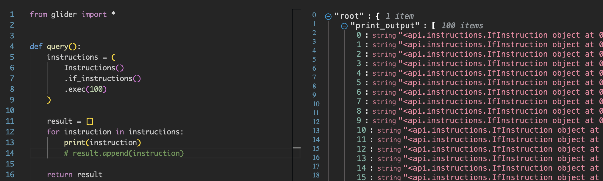

# Instruction

The last of the trio, `Instruction`, is another huge class with 44 methods in total + 5 from its child classes (there will be more!). This here is where you'll spend most of your time when you write complex glides, trying to generalize the way your code processes different combinations of Solidity instructions expressed through the Glider's objects.

## Children

`Instruction` comes in many forms, like:

- `AssemblyInstruction`
- `IfInstruction`
- `NewVariableInstruction`
- `ReturnInstruction`
- `ThrowInstruction`
- ...

Each child class represents a type of Solidity instruction. For example, if you filter `if` condition statements in the declarative query, the resulting instructions will all be of the `IfInstruction` class:

```python
from glider import *


def query():
    instructions = (
        Instructions()
        .if_instructions()
        .exec(1)
    )

    result = []
    for instruction in instructions:
        print(instruction)
        result.append(instruction)

    return result


```



## Methods

Each child will gradually have more individual methods, but they all inherit from the general `Instruction`.

The most useful methods are:

- `.get_callee_values()` to get all calls that an instruction contains (internal too)
- `.get_operands()` to break an instruction down into several separate operands
- `.get_parent()` to step up to the parent function or modifier
- `.instruction_data` to get the low-level data about an instruction; very interesting and helps you understand more about how Glider works
- `.is_storage_read()` and `.is_storage_write()` to check whether an instruction contains a storage read or write
- `.next_instruction()`, `.previous_instruction()`, and their 's siblings return a list of instructions that come before or after
- `.backward_df()` and `.forward_df()` are similar to the methods above, but they use dataflow instead and return instructions that come before or after and contain some functions used in the current instruction
- The group of `.is_if()`, `.is_return()`, and other methods repeating the child classes above to check whether a particular instruction is an instance
- `.source_code()`

See them all [here](https://glide.gitbook.io/api/instruction).

I'll talk about some of these methods in other articles because they can be pretty tricky to grasp at once, like the dataflow or instruction data.

## Example

Check the following glide:

```python
from glider import *


def query():
    instructions = (
        Instructions()
        # .external_calls()
        .exec(10)
    )

    result = []
    for instruction in instructions:
        print(instruction.source_code())

        callees = instruction.get_callee_values()
        print(callees)
        for callee in callees:
            print(callee.expression)

        operands = instruction.get_operands()
        print(operands)
        for operand in operands:
            print(operand.expression)

        print("==========")

    return result

```

I wrote it to show the difference between `.get_callee_values()` and `.get_operands()`. You can play a little and uncomment the external calls filter or add another one to see the difference in instruction types and their operands/callees. Change the offset to see other entries.
