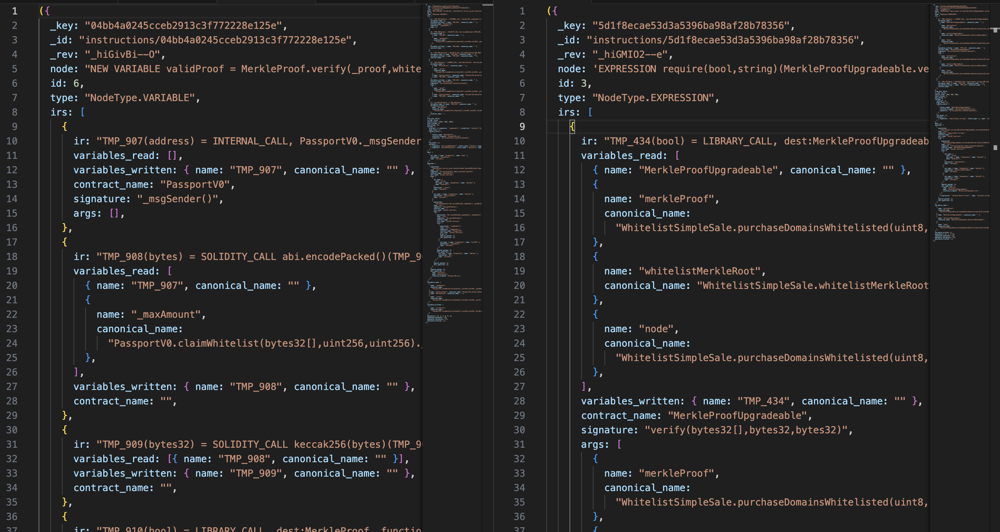

# Low-Level Data (part 2)

> [!WARNING]
> UPD. The propery was deprecated

Continuing yesterday's article, today we'll talk about the `.instruction_data` property of an `Instruction`. I find it very helpful when dealing with instructions, and I use it a lot. The property is quite complex, though; sometimes, it's not very obvious how to process the information it gives.

## instruction_data

The property contains all the low-level information about an instruction's representation in Glider. This includes IRs, callees, operands, used variables, etc. It helps you visualize and compare several target instructions to _abstract your processing logic_.

## Example

Alright, what can be better than a good sample of code!

Look at the glide below:

```python
from glider import *


def query():
    instructions = (
        Contracts()
        .mains()
        .with_compiler_range("0.8.0", "0.9.0")
        .functions()
        .with_one_property([MethodProp.EXTERNAL, MethodProp.PUBLIC])
        .instructions()
        .external_calls()
        .exec(1)
    )

    result = []
    for instruction in instructions:
        print(instruction.instruction_data)

    return result
```

It returns the following JSON:

```js
({
  _key: "f10abbeb3ee6e58d99cf116c96ba861f",
  _id: "instructions/f10abbeb3ee6e58d99cf116c96ba861f",
  _rev: "_hiGMBwS--b",
  node: "EXPRESSION erc20token.transferFrom(msg.sender,address(this),9000)",
  id: 2,
  type: "NodeType.EXPRESSION",
  irs: [
    {
      ir: "TMP_57 = CONVERT this to address",
      variables_read: [{ name: "this", canonical_name: "" }],
      variables_written: { name: "TMP_57", canonical_name: "" },
      contract_name: "",
    },
    {
      ir: "TMP_58(bool) = HIGH_LEVEL_CALL, dest:erc20token(IERC20), function:transferFrom, arguments:['msg.sender', 'TMP_57', '9000']",
      variables_read: [
        {
          name: "erc20token",
          canonical_name:
            "BlukSender.multisendToken(address,address[]).erc20token",
        },
        { name: "msg.sender", canonical_name: "" },
        { name: "TMP_57", canonical_name: "" },
      ],
      variables_written: { name: "TMP_58", canonical_name: "" },
      contract_name: "IERC20",
      signature: "transferFrom(address,address,uint256)",
      args: [
        { name: "msg.sender", canonical_name: "" },
        { name: "TMP_57", canonical_name: "" },
        { name: "9000", canonical_name: "" },
      ],
    },
  ],
  from_asm: False,
  is_cmp: False,
  source_lines: [175],
  start_column: 13,
  end_column: 67,
  callees: {
    internal: [],
    high_level: [
      {
        contract_name: "IERC20",
        relative_filepath: "BlukSender.sol",
        signature: "transferFrom(address,address,uint256)",
        is_static: False,
        contract_key: "contracts/281441a46084f0c67385777fd1a781b3",
      },
    ],
    library_calls: [],
    low_level: [],
    solidity: [],
  },
  dest: [],
  operands: [
    {
      expression: "erc20token.transferFrom(msg.sender,address(this),9000)",
      type: "call",
      signature: "transferFrom(address,address,uint256)",
      contract_name: "IERC20",
      call_type: "normal_function",
      args: [
        {
          var_type: { type: "elementary", name: "address" },
          expression: "msg.sender",
          type: "variable",
        },
        {
          var_type: { type: "elementary", name: "address" },
          expression: "this",
          type: "variable",
        },
        { expression: "9000", type: "constant_number" },
      ],
      special_params: {},
      call_qualifier: {
        var_type: {
          type: "contract",
          name: "IERC20",
          relative_filepath: "BlukSender.sol",
        },
        expression: "erc20token",
        type: "variable",
      },
    },
  ],
  variables_read: [
    {
      name: "erc20token",
      canonical_name: "BlukSender.multisendToken(address,address[]).erc20token",
    },
    { name: "this", canonical_name: "" },
    { name: "msg.sender", canonical_name: "" },
  ],
  variables_written: [],
  dominators: [1, 0, 2],
  immediate_dominator: [1],
  dominator_successors: [5],
  dominance_frontier: [],
});
```

It's quite lengthy, I know. Let's make some sense out of it:

1. Check out `node` and `type` to understand what the instruction looks like and what type it has.
2. `callees`, `operands`, and `dest` arrays contain data equal to the return values of the corresponding `.get_*` methods in `Instruction` (e.g., [`.get_operands()`](https://glide.gitbook.io/main/api/instruction/instruction.get_operands)).
3. Obviously, `variables_read` and `variables_written` contain the variables this instruction uses.
4. `irs` describes the same instruction but in a more detailed way, step-by-step.

> Once again, `.instruction_data` is more suitable for debugging purposes, and I encourage you to avoid it in a production glide, but there are values you can't get with the high-level methods yet.

Also, try to change the glide to something more precise, like getting all `MerkleProof.verify()` calls, and compare several `.instruction_data` side to side:



This will help you understand how to generalize your code for different contexts.
